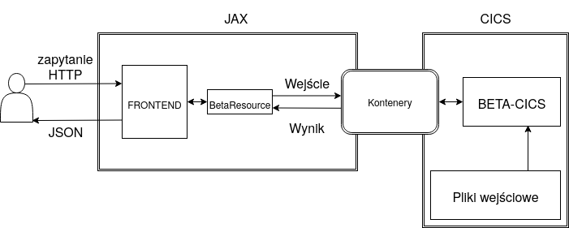

# BETA-CICS
Oblicza [współczynnik beta](https://pl.wikipedia.org/wiki/Wsp%C3%B3%C5%82czynnik_beta) dla dwóch wskazanych spółek giełdowych, używając CICS-a. Aplikacja webowa udostepnia REST API oraz korzystający z niego interfejs webowy. Obliczenia są przeprowadzone w COBOL-u.

Program został przedstawiony podczas spotkania kończącego zajęcia *Języki i Narzędzia Programowania 3 - Wstęp do programowania w z/OS* ([link](https://github.com/wojtekk23/BETA-CICS/blob/main/prezentacja.pdf) do prezentacji naszego zespołu)



## Struktura repozytorium

* `/src/Cobol` zawiera plik źródłowy z programem BETA-CICS
* `/src/Java` zawiera implementację back-endu dla REST API oraz interfejsu
* `/src/HTML` zawiera pliki HTML używane w interfejsie webowym.
* `/src/Python` zawiera program generujący dane testowe
* `/input` zawiera przykładowe pliki wejściowe: `BECIIN01`, `BECIIN02` to pliki testowe, zaś `BECICDP` i `BECIWIG` to zwroty odpowiednio dla CDP i WIG
* `/imgs` zawiera obrazki pomocnicze

## Symulator

Przy symulacji danych założyliśmy, że średnia zwrotów wynosi zero. Program zwraca kolejne rekordy obu plików, prawdziwą betę oraz obliczoną betę.

## Cobol
### Dane
Zakładamy, że dane wejściowe dla aplikacji składają się z policzonych już zwrotów dla danych inwestycji i są przechowywane w zbiorach VSAM z formatem rekordu:
```
01 WS-X-LINE.
   05 WS-X-KEY  PIC 9(5) COMP.
   05 FILLER    PIC X(4) VALUE SPACES.
   05 WS-X-VAL  PIC X(12).
   05 FILLER    PIC X(160) VALUE SPACES.
```
gdzie `WS-X-KEY` jest indeksem dnia, a `WS-X-VAL` wartością zwrotu w danym dniu, zapisaną w formacie `S9(3)V9(12)`, np:
```
00001    +000.000964
00002    -000.011885
00003    +000.014356
00004    +000.000177
00005    +000.006058
...
```

Dane wejściowe powinny być wprowadzone do tej samej grupy CICS-owej, w której znajduje się nasz program.

### Działanie programu

Aplikacja przyjmuje jako parametry zakres dni, z którego pobierane są wartości do obliczeń, oraz nazwy dwóch plików, z których będą odczytywane rekordy. Parametry te są pobierane poprzez mechanizm [kontenerów CICS-owych](https://www.ibm.com/support/knowledgecenter/en/SSB27H_6.2.0/dfhe7_containers_channels_overview.html).

Następnie obliczany jest współczynnik beta, a wynik również jest przekazywany przez kontener. W przypadku wystąpienia obsługiwanego błędu, program wysyła kod błędu do użytkownika. Wystąpienie nieobsługiwanego błędu kończy się ABEND-em.

## Java

### REST API
Dostęp do API odbywa się poprzez metodę GET w następującym formacie:
`/rest/beta/{inputA}/{inputB}/{beginText}/{endText}` \
gdzie kolejne parametry to:
* `inputA` - nazwa pliku względem którego obliczana jest wariancja w mianowniku współczynnika beta
* `inputB` - nazwa drugiego pliku
* `beginText` - liczba, oznacza pierwszy dzień zakresu używanego do obliczeń
* `endText` - liczba, oznacza ostatni dzień zakresu używanego do obliczeń

Odpowiedź jest w formacie JSON:
* `time` - czas wysłania odpowiedzi
* `status` - w przypadku wystąpienia obsługiwanego błędu wynosi `ERROR`, w przypadku poprawnego wykonania zwraca `RESULT`
* `result` - w przypadku wystąpienia obsługiwanego błędu przyjmuje jego nazwę, w przypadku poprawnego wykonania zwraca współczynnik beta w formacie Cobolowym: `S9(3)V9(12)`. Np. tekst `+001234560000000` oznacza liczbę `1.23`.

### Interfejs webowy
Interfejs webowy znajduje się w endpoincie: `/rest/front`. Pozwala na wybranie dwóch plików (załączone są dwa testowe pliki oraz pliki zawierające obliczone zwroty CDP oraz WIG dla tego samego zakresu dni) oraz pierwszego i ostatniego dnia, na podstawie którego obliczany jest współczynnik.

# Autorzy
Wojciech Kłopotek, Wojciech Olejniczak
